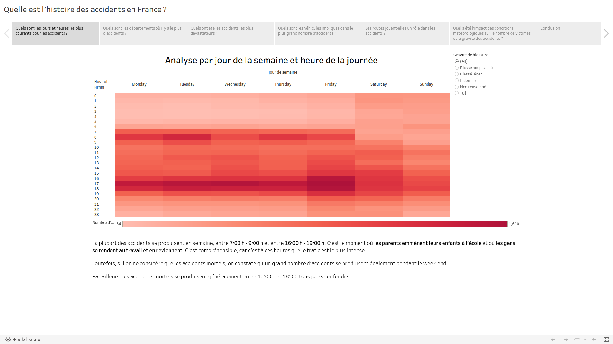

# France Road Accidents Analysis

  

  

    <ul>
      
<h1 style="display: inline-block;">📊 France Road Accidents Analysis 📊</h1>

    </ul>
  

  
  

    <a href="https://public.tableau.com/app/profile/youcef.abdelliche/viz/Projetdataviz_17019031480550/StoryQuelleestlhistoiredesaccidentsenFrance="_blank">Dashboard</a>

 

## Project overview

An analysis of the road accidents that happened in France during 2021–2022.

## Relevant links

[Data sources](https://www.data.gouv.fr/fr/datasets/bases-de-donnees-annuelles-des-accidents-corporels-de-la-circulation-routiere-annees-de-2005-a-2022/) | [Tableau story](https://public.tableau.com/app/profile/youcef.abdelliche/viz/Projetdataviz_17019031480550/StoryQuelleestlhistoiredesaccidentsenFrance) |
